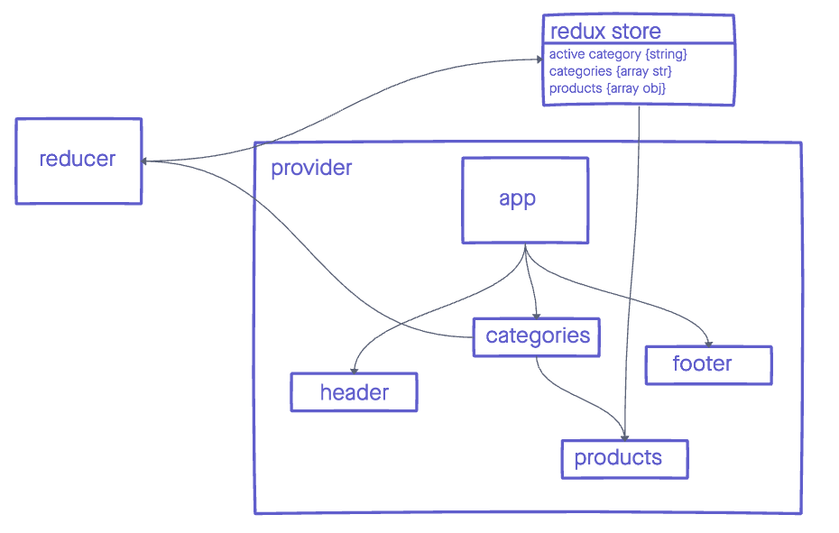

# Redux Storefront

A basic store front built with React and Redux that utilizes a live api.

## 🚀 Getting started

1. Install dependencies with `npm i` or `yarn i`
1. Run tests with `npm test`
1. Start a development server `npm start`

## 📖 Table of Contents

1. [Phase 1 stories](#-🚧-Phase-1)

1. [Phase 2 stories](#-🚧-Phase-2)

## 🏢 Architecture

## 🚧 Phase 1

* As a user, I expect to see a list of available product categories in the store so that I can easily browse products

* As a user, I want to choose a category and see a list of all available products matching that category

* As a user, I want a clean, easy to use user interface so that I can shop the online store with confidence

## 🚧 Phase 2

* As a user, I want to choose from products in the list and add them to my shopping cart

* As a user, I want to see the products that I’ve added to my shopping cart so that

* As a user, I want to change the quantity of items I intend to purchase in my shopping cart

* As a user, I want to be able to remove an item from my shopping cart

* As a user, I want to see the name of the category I'm currently viewing

## 🔍 Further reading

[Material UI](https://material-ui.com/)

[Redux](https://redux.js.org/)